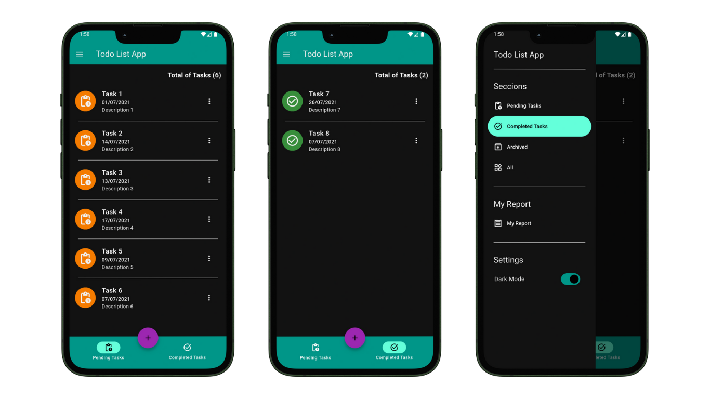
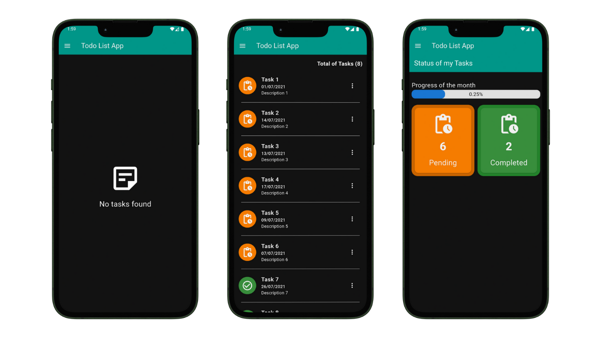
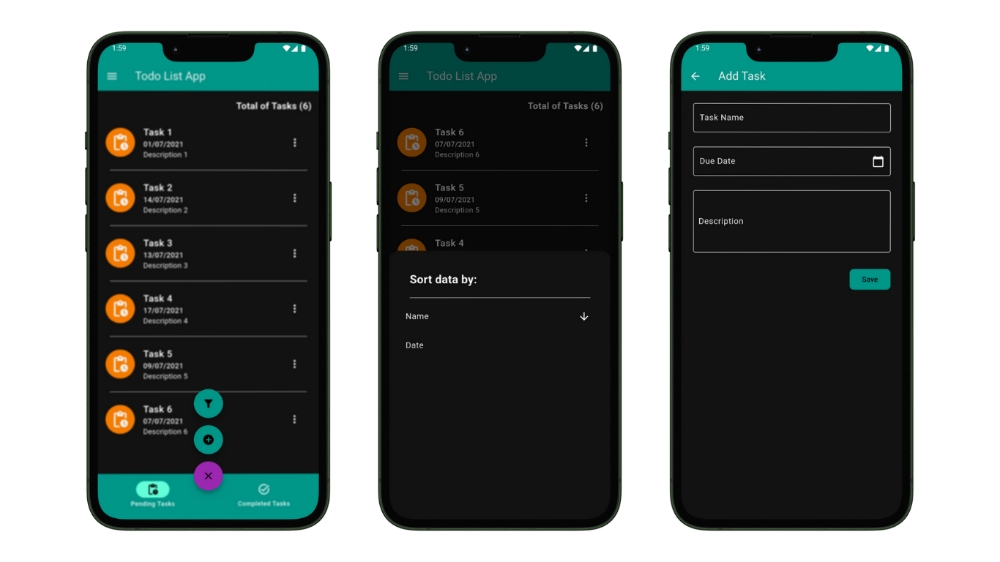

# Flutter Todo List App

This app was created using Flutter **3.29.2**, Dart **3.7.2** and DevTools **2.42.3**.
It is a basic CRUD app for task, with some features like sorting, and mark tasks like pending, completed and archived. Also you can see a litle report about your progress.

## Tech Stack

**Client:** Flutter **3.29.2**, Dart **3.7.2** and DevTools **2.42.3**.

## Demo

## Author

- [@danielmontes9](https://github.com/danielmontes9)
